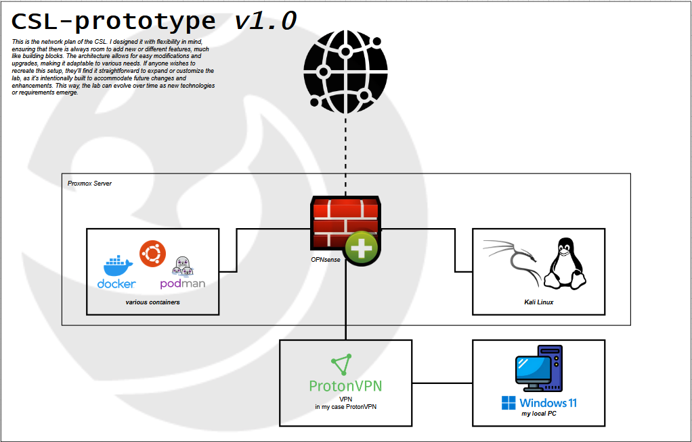
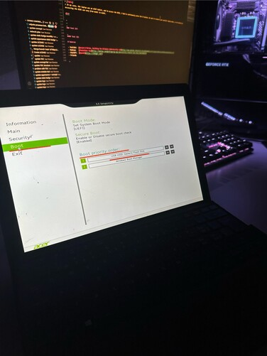

  

    <picture>
      <source media="(prefers-color-scheme: dark)" srcset="assets/images/stock/pantera-1.4.png">
      <source media="(prefers-color-scheme: light)" srcset="assets/images/stock/pantera-1.3.png">
      
    </picture>
  

   

  
  
  
  

 

# Overview
In this project, I will document the process of creating a **C**yber**s**ecurity **L**ab at home. The goal is to establish an environment protected from potential attacks or exploits that an external malicious user might try to take advantage of. I will be building this from scratch and will make sure to document every single step, as I believe this will help me reflect better when I want to update or change something. 
  
This is not a tutorial or guide, just a documentation of my work and progress, the way I approach it.
I want to mention that you don’t have to follow every step exactly as I did. I’ll be documenting everything, including some details that may not be strictly necessary.

 

> [!NOTE]
> It is possible that my documentation and project may contain some mistakes or errors. Therefore, some prior knowledge of the topic is necessary to ensure clarity and avoid confusion.

 

# Concept
Before starting, I created a prototype of the network plan using [Draw.io](https://app.diagrams.net/). The goal was to visualize my ideas and ensure that everything could be connected logically. I didn’t focus much on design, as I wanted to confirm the plan’s feasibility before refining its appearance.

These are some of the points I wanted to include in my Cybersecurity Lab:

- Containers
- Kali Linux
- Firewall / monitoring tools
- Private network for protection from external threats
  - IP configuration
  - Subnetting
  - Possible Testing Environment

 

| network plan - draw.io |
|:--------------------------------------------------:|
||

 

# What do you need?
Throughout this project, I will be adding to and adjusting my documentation as needed. For now, here are the essential components you'll need:
- [Proxmox](https://www.proxmox.com/en/)
- 

## Installation and configuration
Before I actually began the project, I wanted to install and configure all the necessary software, ISO files, etc., so that everything was ready for the CSL. The goal was to prepare everything in advance and save time during the different stages of the project.

### Proxmox
For the Proxmox installation and configuration, I used the [documentation](https://www.proxmox.com/en/proxmox-virtual-environment/get-started) provided by Proxmox themselves and followed it step by step. Keep in mind to read carefully and not just click through—take the time to understand each step.

 

> [!CAUTION]
> Installing the Proxmox ISO Installer will permanently overwrite the disk it is installed on, as it is a bare-metal installer. This means that any existing data will be permanently removed. Proceed with caution!

 

You should be able to install it on your own, as the documentation is quite clear. Here are the steps I followed for the installation:

- Download the Proxmox ISO image installer (*in my case the 8.2-2 version*)
- Download [Rufus](https://rufus.ie/de/) or another USB burning tool
- Burn the Proxmox ISO onto a USB drive with at least 8GB of free space
- I used my old laptop to boot Proxmox from the USB drive --> BIOS
- Proceed with the Proxmox installation

 

> [!WARNING]  
> As mentioned earlier, burning this disk with the Proxmox ISO file will permanently erase **ALL DATA** on the selected disk!

 

<h4>Rufus Setup</h4>

  
  

 

<h4>Proxmox Booting via USB Drive - 1st Attempt</h4>

  
  

 

I proceeded with the installation and setup of Proxmox on my Acer laptop but encountered several issues. When I attempted to apply the configurations I had made, an error kept occurring despite my various attempts to fix it. The root of the problem was that the Proxmox installer had difficulties with the laptop's partition. I tried multiple solutions, but unfortunately, none were successful.

To keep a long story short, the real reason Proxmox had issues with my laptop’s partition was that the eMMC itself was damaged or faulty.

If you’d like to read through my troubleshooting process, you can find all the documentation in the ***troubleshooting folder*** or [here](troubleshooting/troubleshooting-partition-issue.md).

 

> [!TIP]  
> In my case, the laptop was an ACER Switch Alpha 12, which came with eMMC (embedded MultiMediaCard) storage. eMMCs are often found in budget devices due to their low cost, but they provide limited performance and durability compared to other storage options. They are suitable for basic tasks but lack the speed and reliability needed for more demanding applications.

 

 
 
 
 

### Test 123
> [!NOTE]  
> Highlights information that users should take into account, even when skimming.

> [!TIP]
> Optional information to help a user be more successful.

> [!IMPORTANT]  
> Crucial information necessary for users to succeed.

> [!WARNING]  
> Critical content demanding immediate user attention due to potential risks.

> [!CAUTION]
> Negative potential consequences of an action.

#### Test 321

##### Test 123321

# Sources

- YouTube:  [Gerard O'Brien, Building the Ultimate Cybersecurity Lab](https://www.youtube.com/watch?v=XIvn0ZDSmKA&list=PL3ljjyal211AbTqlxSo6CGBiVqsXw8wrp&index=22)
- Medium:   [TheInfoSec Guy](https://medium.com/@jibingeorge.mg/cybersecurity-research-lab-setup-5beb54d8dd59)
- ChatGPT:  [OpenAI](https://chatgpt.com/)
- Friends

