<div align="center">
  <div style="text-align: center;">
    <picture>
      <source media="(prefers-color-scheme: dark)" srcset="sources/stock/pantera-1.4.png">
      <source media="(prefers-color-scheme: light)" srcset="sources/stock/pantera-1.3.png">
      
    </picture>
  </div>

  <br>

  [](https://github.com/callme-pantera/CSL-prototype/issues)
  [](https://github.com/callme-pantera/CSL-prototype/stargazers)
  [](https://github.com/callme-pantera/CSL-prototype/commits/main/)
  [](LICENSE)
</div>

<br>


# CSL-prototype
- [CSL-prototype](#csl-prototype)
- [Overview](#overview)
- [Concept](#concept)
- [What do you need?](#what-do-you-need)
  - [Installation and configuration](#installation-and-configuration)
    - [Proxmox](#proxmox)
      - [Troubleshooting - Potential Partition Error](#troubleshooting---potential-partition-error)
    - [Test 123](#test-123)
      - [Test 321](#test-321)
        - [Test 123321](#test-123321)
- [Sources](#sources)


# Overview
In this project, I will document the process of creating a **C**yber**s**ecurity **L**ab at home. The goal is to establish an environment protected from potential attacks or exploits that an external malicious user might try to take advantage of. I will be building this from scratch and will make sure to document every single step, as I believe this will help me reflect better when I want to update or change something. This is not a tutorial or guide, just a documentation of my work and progress, the way I approach it.
I want to mention that you don’t have to follow every step exactly as I did. I’ll be documenting everything, including some details that may not be strictly necessary.

<br>

> [!NOTE]
> It is possible that my documentation and project may contain some mistakes or errors. Therefore, some prior knowledge of the topic is necessary to ensure clarity and avoid confusion.

<br>

# Concept
Before starting, I sat down and created a network plan using [Draw.io](https://app.diagrams.net/). The goal was to visualize my ideas and ensure that everything could be connected logically. I didn’t focus much on design, as I wanted to confirm the plan’s feasibility before refining its appearance.

These are some of the points I wanted to include in my Cybersecurity Lab:
- IP configuration
- Containers
- Kali Linux
- Firewall / monitoring tools (OPNsense)
- Private network for protection from external threats

<br>

| network plan - draw.io |
|:--------------------------------------------------:|
|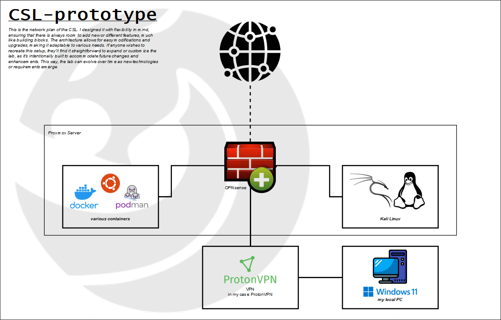|

<br>

# What do you need?
Throughout this project, I will be adding to and adjusting my documentation as needed. For now, here are the essential components you'll need:
- [Proxmox](https://www.proxmox.com/en/)
- 

## Installation and configuration
Before I actually began the project, I wanted to install and configure all the necessary software, ISO files, etc., so that everything was ready for the CSL. The goal was to save time between the different stages of the project.

### Proxmox
For the Proxmox installation and configuration, I used the [documentation](https://www.proxmox.com/en/proxmox-virtual-environment/get-started) provided by Proxmox themselves and followed it step by step. Keep in mind to read carefully and not just click through—take the time to understand each step.

<br>

> [!CAUTION]
> Installing the Proxmox ISO Installer will permanently overwrite the disk it is installed on, as it is a bare-metal installer. This means that any existing data will be permanently removed. Proceed with caution!

<br>

You should be able to install it on your own, as the documentation is quite clear. Here are the steps I followed for the installation:

- Download the Proxmox ISO image installer (*in my case the 8.2-2 version*)
- Download [Rufus](https://rufus.ie/de/) or another USB burning tool
- Burn the Proxmox ISO onto a USB drive with at least 8GB of free space
- I used my old laptop to boot Proxmox from the USB drive --> BIOS
- Proceed with the Proxmox installation

<br>

> [!WARNING]  
> As mentioned earlier, burning this disk with the Proxmox ISO file will permanently erase ALL DATA on the selected disk!

<br>

<h4>Rufus Setup</h4>
<div style="display: flex; justify-content: space-between;">
  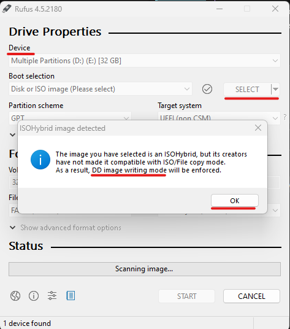
  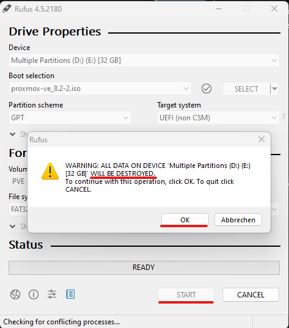
</div>

<br>

<h4>Proxmox Booting via USB Drive</h4>
<div style="display: flex; justify-content: space-between;">
  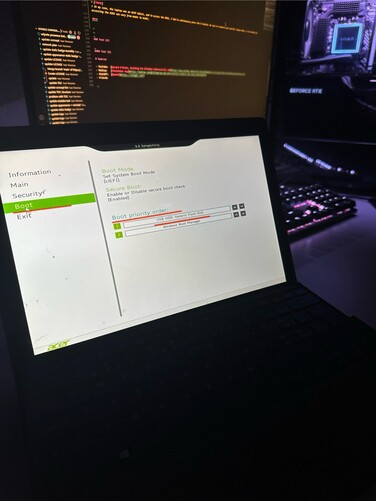
  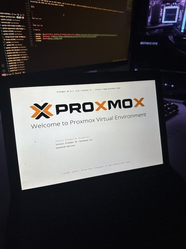
</div>

<br>

> [!TIP]  
> In my case, the laptop was an ACER Switch Alpha 12, and to access the BIOS, I had to continuously press the F2 button. Be sure to research your specific laptop model, as the method for accessing the BIOS can vary from model to model.

<br>

I proceeded with the installation and setup of Proxmox on my Acer laptop but encountered several issues. When I attempted to apply the configurations I had made, an error kept occurring, regardless of what I tried to fix it. The root of the problem was that the Proxmox installer had difficulties with the laptop's partition. I tried multiple solutions, but unfortunately, none were successful.


#### Troubleshooting - Potential Partition Error
If you're interested in my troubleshooting process, feel free to read on. I can’t guarantee that everything will be perfectly clear, as I didn’t intend to write this section in great detail. While I may not find a solution, I will still document the entire process. <br>

As mentioned earlier, I tried several solutions before moving on to the partition troubleshooting. If you encounter the same issue, please make sure you've tried the following steps first:

| Cause                            | Description                                                                                                               | Solution                                                                                                                                     |
|----------------------------------|---------------------------------------------------------------------------------------------------------------------------|----------------------------------------------------------------------------------------------------------------------------------------------|
| Hardware Compatibility           | Possible hardware incompatibility with Proxmox, especially regarding the hard drive or eMMC storage.                      | - Ensure that your hardware is compatible with Proxmox, particularly the hard drive or eMMC storage.                                         |
| Faulty Installation Medium       | The installation medium may be damaged or incorrectly created.                                                            | - Check the installation medium for errors.<br> - Recreate the medium using a reliable tool like Rufus or Etcher.                            |
| Incorrect Storage Device Type    | Attempting to install Proxmox on an eMMC or SD card storage, which can lead to problems.                                  | - Install Proxmox on a conventional SSD or HDD, if available.                                                                                |
| BIOS/UEFI Settings               | Incorrect BIOS/UEFI configuration that prevents booting from the installation medium.                                     | - Check if BIOS/UEFI is correctly configured to boot from the installation medium.<br> - Adjust the boot mode (UEFI or Legacy) as necessary. |
| **Partitioning Issues**          | Problems with creating or accessing necessary partitions.                                                                 | - Use GParted from a Live-USB Linux system to check and adjust partitioning.<br> - Delete existing partitions for a clean installation.      |

<br>

I attempted to fix the partitioning issues by booting an Ubuntu Desktop ISO on the laptop and using the GParted tool for partitioning. I created a new partition, hoping it would resolve the issue, as the fresh partition shouldn’t have any errors or problems. Unfortunately, this didn’t work either, and I had to improvise.
I did some research in old Proxmox forums and, luckily, I found someone who had the same issue and managed to fix it. The website was in Chinese, but another user had thankfully translated it, making it easy to follow from there. <br>

**Step 1:**  
Instead of the normal Graphical Installation, I clicked on *Advanced Options* and selected the *Terminal UI, Debug Mode* installation method.

**Step 2:**  
After selecting it, a command prompt appeared. I exited this prompt because it wasn’t the one we needed. After exiting, I was redirected to the correct command prompt.

**Step 3:**  
To proceed, I needed to edit a crucial configuration file for the installation process.
```
$ cd /usr/share/perl5/Proxmox/Sys/
$ nano Block.pm 
```

**Step 4:**  
In the file, I located the "partition section" to define the correct parameters:
```
} elsif ($dev =~ m|^/dev/mmcblk\d+$|) {
     return "${dev}p$partnum";
```
After making the changes, I saved the file and exited.  
*Note: The code in the screenshot is incorrect; use the one provided in my repository.*

**Step 5:**  
I then proceeded with the installation as normal and waited for it to finish.

<br>

> [!IMPORTANT]  
> [Original Chinese website](https://18kas.com/pve-with-emmc) and [the translated website](https://ibug.io/blog/2022/03/install-proxmox-ve-emmc/)

<br>

<h4>Proxmox Terminal UI, Debug Mode</h4>
<div style="display: flex; justify-content: space-between;">
  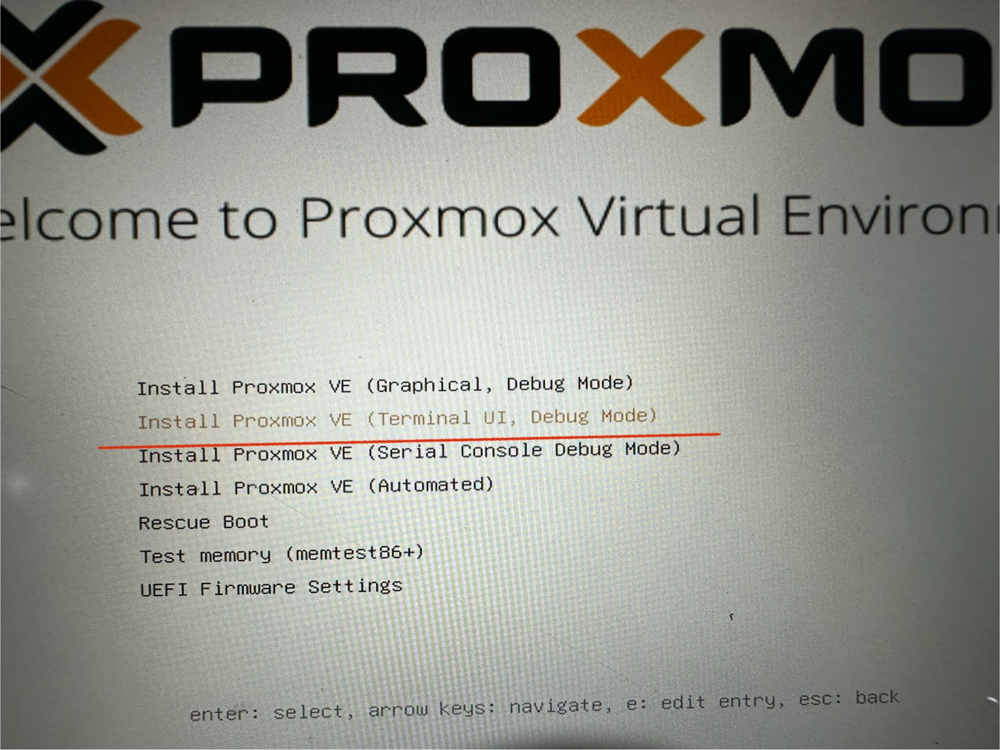
  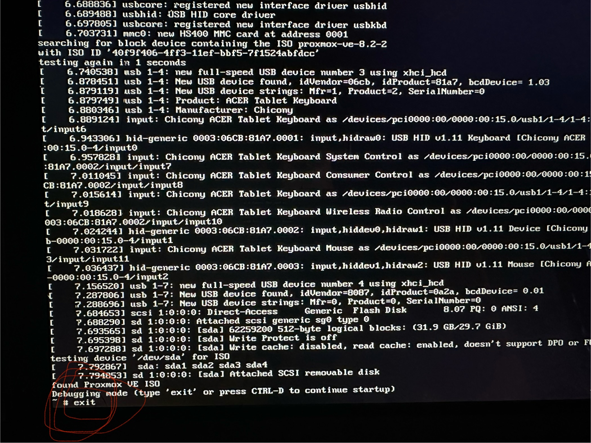
</div>

<br>

<h4>Debug Mode - config file</h4>
<div style="display: flex; justify-content: space-between;">
  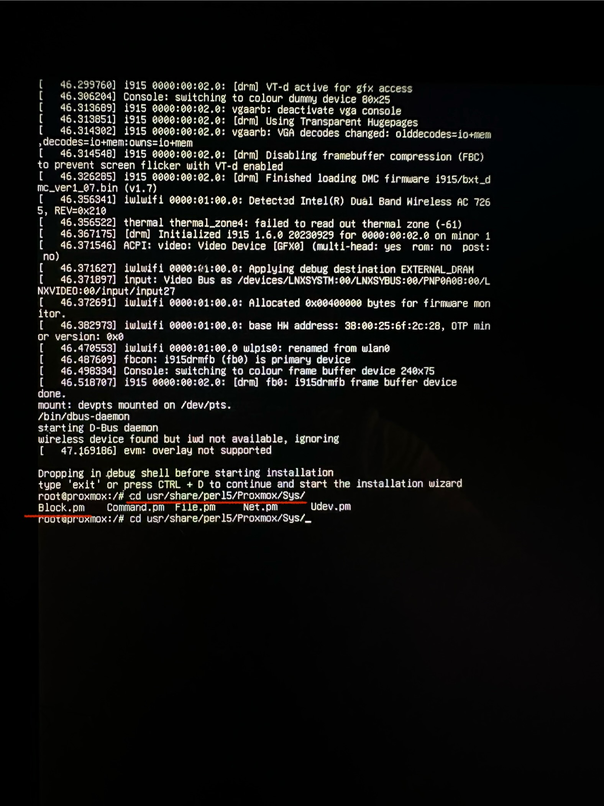
  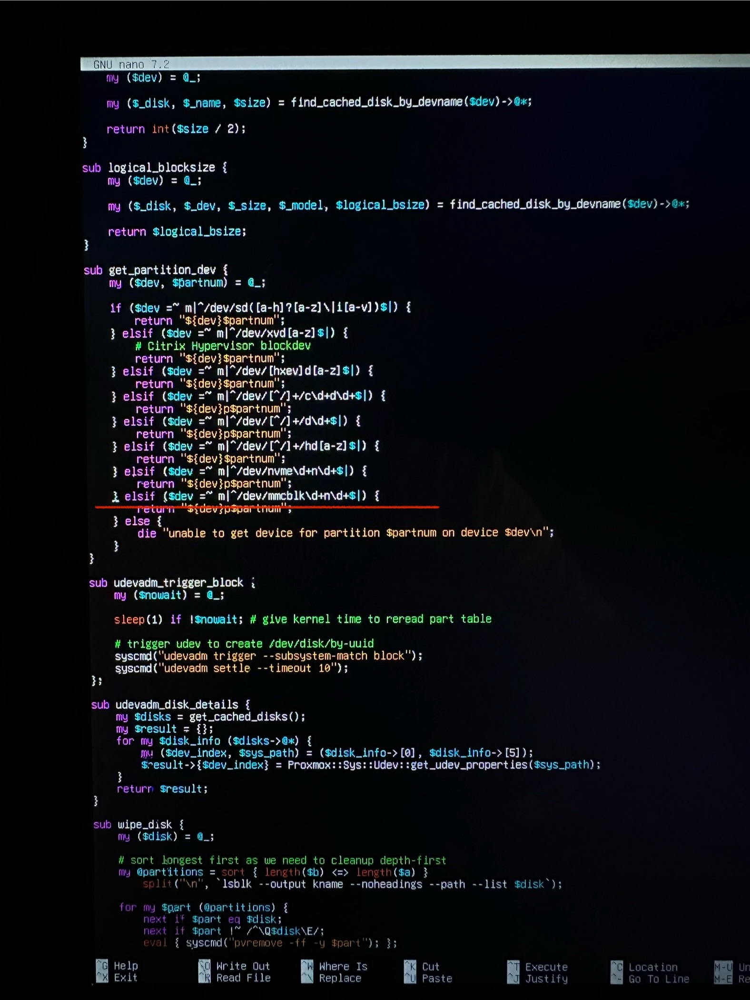
  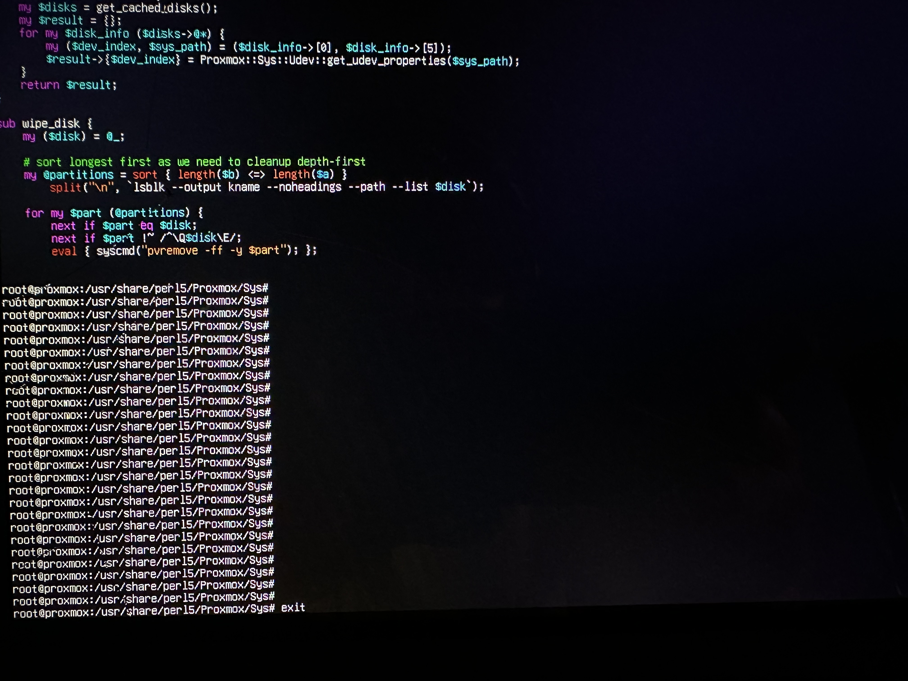
  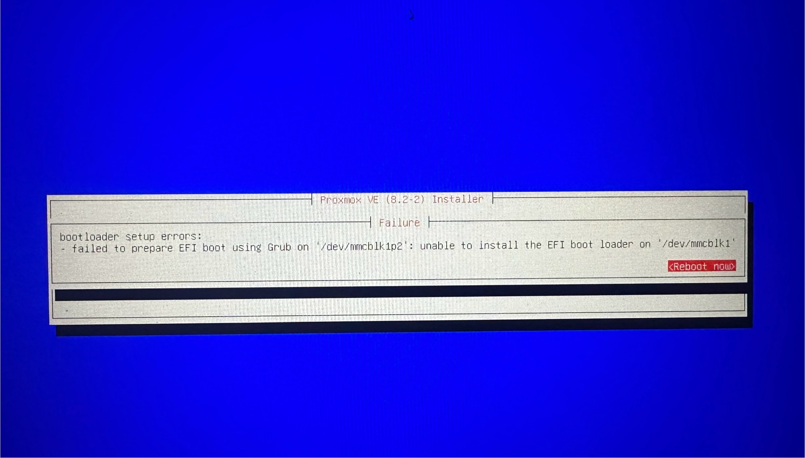
</div>

<br>

The problem turned out to be rather simple and obvious, but since I was working on this late at night (or early morning), my brain wasn’t sharp enough to catch it right away. Here’s how I **attempted** to solve the issue:

- Installed an Ubuntu Desktop ISO and burned it onto my USB stick.
- Instead of installing Ubuntu, I chose the "Try Ubuntu" option (either works).
- Used Gparted to fix, redo, or configure the partitions.
- After saving, I booted the Proxmox installation in Debug Mode again.

Unfortunately, it didn’t work again. I realized I had a much bigger problem: damage to the eMMC itself. In an attempt to fix my laptop, I disassembled it and found that the cost of repair wasn’t worth it.

In short, the issue was that the BIOS boot order didn’t list anything besides the flash drive. It didn’t even recognize the hard drive, which indicated a hardware issue. Upon disassembling, I found that pretty much everything was loose or worn out—understandable since I hadn’t taken care of it for ages, especially during my school days.<br>

Unfortunately, I have to halt this project until further notice, as I don’t have a spare laptop or computer. If I can’t find one soon, I’ll either buy one or resort to using VMs, which I’d prefer not to do for my Cyberlab. I want to run it on physical hardware, not fully virtualized—because, why not?


### Test 123
> [!NOTE]  
> Highlights information that users should take into account, even when skimming.

> [!TIP]
> Optional information to help a user be more successful.

> [!IMPORTANT]  
> Crucial information necessary for users to succeed.

> [!WARNING]  
> Critical content demanding immediate user attention due to potential risks.

> [!CAUTION]
> Negative potential consequences of an action.

#### Test 321

##### Test 123321

# Sources

- YouTube:  [Gerard O'Brien, Building the Ultimate Cybersecurity Lab](https://www.youtube.com/watch?v=XIvn0ZDSmKA&list=PL3ljjyal211AbTqlxSo6CGBiVqsXw8wrp&index=22)
- Medium:   [TheInfoSec Guy](https://medium.com/@jibingeorge.mg/cybersecurity-research-lab-setup-5beb54d8dd59)
- ChatGPT:  [OpenAI](https://chatgpt.com/)
- Friends

