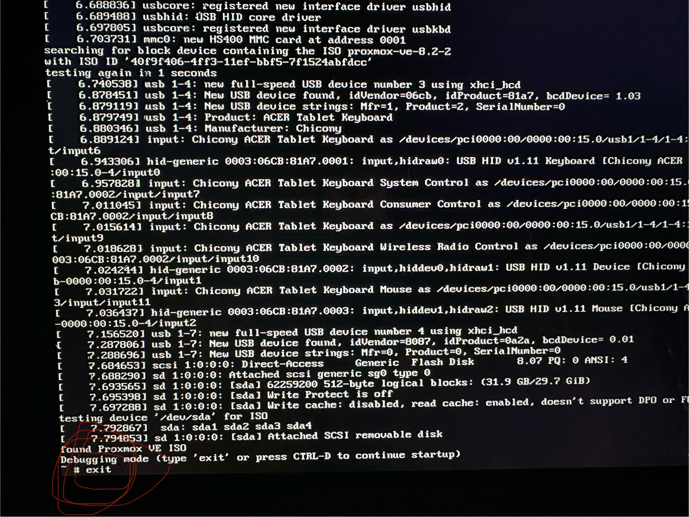
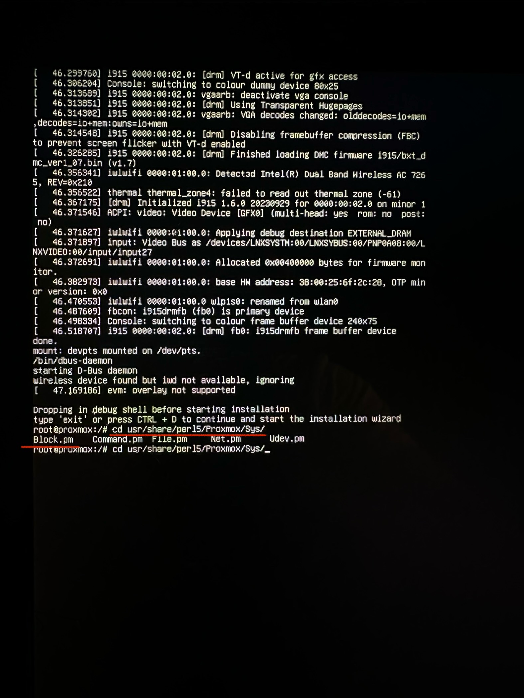

# Troubleshooting - Potential Partition Error
If you're interested in my troubleshooting process, feel free to read on. I can’t guarantee that everything will be perfectly clear, as I didn’t intend to write this section in great detail. While I may not find a solution, I will still document the entire process. <br><br>

As mentioned earlier, I tried several solutions before moving on to the partition troubleshooting. If you encounter the same issue, please make sure you've tried the following steps first:

## Causes and Solutions

| Cause                            | Description                                                                                                               | Solution                                                                                                                                     |
|----------------------------------|---------------------------------------------------------------------------------------------------------------------------|----------------------------------------------------------------------------------------------------------------------------------------------|
| Hardware Compatibility           | Possible hardware incompatibility with Proxmox, especially regarding the hard drive or eMMC storage.                      | - Ensure that your hardware is compatible with Proxmox, particularly the hard drive or eMMC storage.                                         |
| Faulty Installation Medium       | The installation medium may be damaged or incorrectly created.                                                            | - Check the installation medium for errors.<br> - Recreate the medium using a reliable tool like Rufus or Etcher.                            |
| Incorrect Storage Device Type    | Attempting to install Proxmox on an eMMC or SD card storage, which can lead to problems.                                  | - Install Proxmox on a conventional SSD or HDD, if available.                                                                                |
| BIOS/UEFI Settings               | Incorrect BIOS/UEFI configuration that prevents booting from the installation medium.                                     | - Check if BIOS/UEFI is correctly configured to boot from the installation medium.<br> - Adjust the boot mode (UEFI or Legacy) as necessary. |
| **Partitioning Issues**          | Problems with creating or accessing necessary partitions.                                                                 | - Use GParted from a Live-USB Linux system to check and adjust partitioning.<br> - Delete existing partitions for a clean installation.      |

<br>

## Attempt 1: Resolving the Issue - Partition
I attempted to fix the partitioning issues by booting an Ubuntu Desktop ISO on the laptop and using the GParted tool for partitioning. I created a new partition, hoping it would resolve the issue, as the fresh partition shouldn’t have any errors or problems. Unfortunately, this didn’t work either, and I had to improvise.
I did some research in old Proxmox forums and, luckily, I found someone who had the same issue and managed to fix it. The website was in Chinese, but another user had thankfully translated it, making it easy to follow from there. <br>

**Step 1:**  
Instead of the normal Graphical Installation, I clicked on *Advanced Options* and selected the *Terminal UI, Debug Mode* installation method.

**Step 2:**  
After selecting it, a command prompt appeared. I exited this prompt because it wasn’t the one we needed. After exiting, I was redirected to the correct command prompt.

**Step 3:**  
To proceed, I needed to edit a crucial configuration file for the installation process.
```
$ cd /usr/share/perl5/Proxmox/Sys/
$ nano Block.pm 
```

**Step 4:**  
In the file, I located the "partition section" to define the correct parameters:
```
} elsif ($dev =~ m|^/dev/mmcblk\d+$|) {
     return "${dev}p$partnum";
```
After making the changes, I saved the file and exited.  
*Note: The code in the screenshot is incorrect; use the one provided in my repository.*

**Step 5:**  
I then proceeded with the installation as normal and waited for it to finish.

<br>

> [!IMPORTANT]  
> [Original Chinese website](https://18kas.com/pve-with-emmc) and [the translated website](https://ibug.io/blog/2022/03/install-proxmox-ve-emmc/)

<br>

<h4>Proxmox Terminal UI, Debug Mode</h4>
<div style="display: flex; justify-content: space-between;">
  
  
</div>

<br>

<h4>Debug Mode - config file</h4>
<div style="display: flex; justify-content: space-between;">
  
  
  
  
</div>

<br>

## Attempt 2: Resolving the Issue - Advanced Gparted usage
The problem turned out to be rather simple and obvious, but since I was working on this late at night (or early morning), my brain wasn’t sharp enough to catch it right away. Here’s how I **attempted** to solve the issue:

- Installed an Ubuntu Desktop ISO and burned it onto my USB stick.
- Instead of installing Ubuntu, I chose the "Try Ubuntu" option (either works).
- Used Gparted to fix, redo, or configure the partitions.
- Additionally I used the right Labels and Flags for the partition.
- After saving, I booted the Proxmox installation in Debug Mode again.

Unfortunately, it didn’t work again. I realized I had a much bigger problem: ***damage to the eMMC*** itself. In an attempt to fix my laptop, I disassembled it and found that the cost of repair wasn’t worth it.

## Conclusion
In short, the issue was that the BIOS boot order didn’t list anything besides the flash drive. It didn’t even recognize the hard drive, which indicated a hardware issue. Upon disassembling, I found that pretty much everything was loose or worn out — understandable since I hadn’t taken care of it for ages, especially during my school days.<br><br>

Unfortunately, I have to halt this project until further notice, as I don’t have a spare laptop or computer. If I can’t find one soon, I’ll either buy one or resort to using VMs, which I’d prefer not to do for my Cyberlab. I want to run it on physical hardware, not fully virtualized—because, why not?

<br>

# Sources
- [Proxmox forum](https://forum.proxmox.com/threads/unable-to-get-device-for-partition-1-on-device-dev-mmcblk0.42348/)
- [Chinese website for possible solutions](https://18kas.com/pve-with-emmc)
- [Translated website](https://ibug.io/blog/2022/03/install-proxmox-ve-emmc/)
- [Acer Forum](https://community.acer.com/en/discussion/542537/acer-switch-5-or-3-disassembly)
- [Reddit](https://www.reddit.com/r/MSILaptops/comments/jbjo32/i_am_unable_to_remove_the_battery_connector_from/)